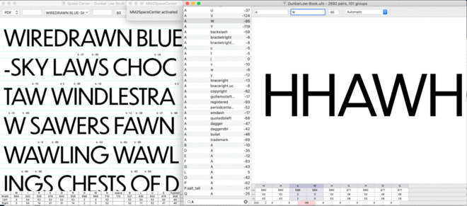

Metrics Machine 2 Space Center
==============================

This extension generates a list of words in Robofont’s Space Center based on the current pair you’re kerning in the [Metrics Machine] extension by Tal Leming.

The wonderful [word-o-mat] extension by Nina Stössinger was a major influence, and this would most certainly not exist if Nina’s word-o-mat hadn’t come first. And thanks to Stephen Nixon for asking about something like this, which encouraged me to share this. I would love to see this extension evolve to have nice menus and an interface as powerful as word-o-mat someday.

Pull requests are greatly appreciated 🙏

++++++++++++++++++

Update: 2022-03-17

–added options for if no pair if found: Auto, UC, LC, Figs, Frac

–made word count field wider

–added support for suffixed glyphs and "any language" option (thanks @weiweihuanghuang and @arrowtype )

–updated structure of UI (thanks @ryanbugden )

–added truncation for longer (unencoded) glyph names

–bugfix for mirrored pairs (thanks @arrowtype )

++++++++++++++++++

Update: 2020-06-30

Thanks to @arrowtype there are now options to:

– Show open+closed context

– Show mirrored pair 

[Metrics Machine]: https://extensionstore.robofont.com/extensions/metricsMachine/
[word-o-mat]: https://github.com/ninastoessinger/word-o-mat
